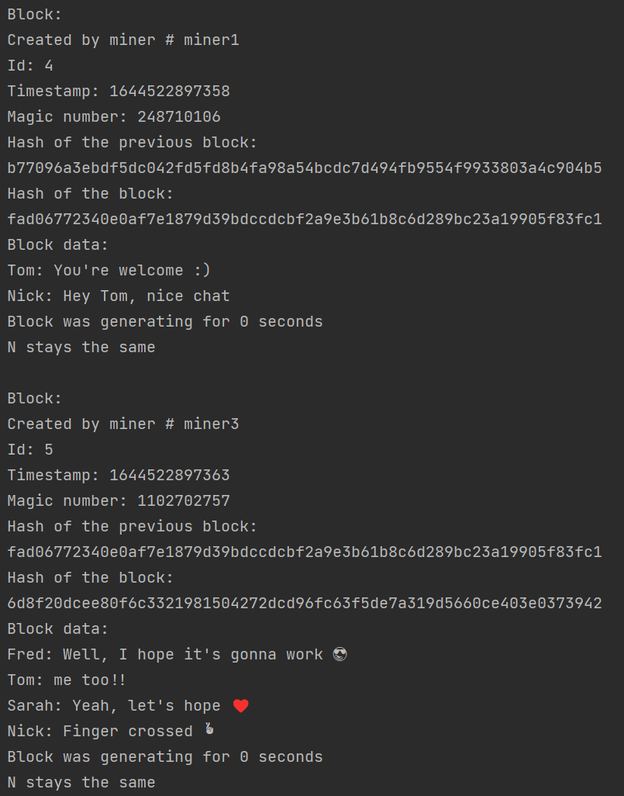

<div id="top"></div>
<!--
*** Thanks for checking out the Best-README-Template. If you have a suggestion
*** that would make this better, please fork the repo and create a pull request
*** or simply open an issue with the tag "enhancement".
*** Don't forget to give the project a star!
*** Thanks again! Now go create amazing blockchain! :D
-->

<!-- PROJECT SHIELDS -->
<!--
*** I'm using markdown "reference style" links for readability.
*** Reference links are enclosed in brackets [ ] instead of parentheses ( ).
*** See the bottom of this document for the declaration of the reference variables
*** for contributors-url, forks-url, etc. This is an optional, concise syntax you may use.
*** https://www.markdownguide.org/basic-syntax/#reference-style-links
-->
[![Contributors][contributors-shield]][contributors-url]
[![Forks][forks-shield]][forks-url]
[![Stargazers][stars-shield]][stars-url]
[![Issues][issues-shield]][issues-url]
[![MIT License][license-shield]][license-url]
<a href="https://twitter.com/webDoubleFx" target="_blank">

</a>

<!-- PROJECT LOGO -->
<br />
<div align="center">
  <a href="https://github.com/doublefx/Blockchain">
    
  </a>

<h3 align="center">Blockchain</h3>
  <p align="center">
    How to implement a blockchain in Java! :smile:
    <br />
    <a href="https://github.com/doublefx/Blockchain"><strong>Explore the docs »</strong></a>
    <br />
    <br />
    <a href="https://github.com/doublefx/Blockchain">View Demo</a>
    ·
    <a href="https://github.com/doublefx/Blockchain/issues">Report Bug</a>
    ·
    <a href="https://github.com/doublefx/Blockchain/issues">Request Feature</a>
  </p>
</div>

<!-- TABLE OF CONTENTS -->
<details>
  <summary>Table of Contents</summary>

  <ol>
    <li>
      <a href="#about-the-project">About The Project</a>
    </li>
    <li>
      <a href="#getting-started">Getting Started</a>
      <ul>
        <li><a href="#prerequisites">Prerequisites</a></li>
        <li><a href="#build-and-run">Build and run</a></li>
      </ul>
    </li>
    <li><a href="#roadmap">Roadmap</a></li>
    <li><a href="#contributing">Contributing</a></li>
    <li><a href="#license">License</a></li>
    <li><a href="#contact">Contact</a></li>
  </ol>
</details>


<!-- ABOUT THE PROJECT -->
## About The Project

I really wanted to get an insight of what it meant to code a blockchain, that's why I signed to follow a [HyperSkill Blockchain Java project](https://hyperskill.org/projects/50), that has really helped me in this regard, therefore I'm taking the opportunity to share it in case some of you would be interested.

This is indeed a naive implementation based on the HyperSkill problems that were asked to be solved, also, it is not decentralized nor distributed, but it gives the insight I expected to get the same.

Blockchains are data structures where blocks are inseparably connected. What makes blockchains so special is the security level they offer due to the way they are constructed. Blockchains are not hackable, so it makes perfect sense why cryptocurrency makes use of this technology.

**Learning outcomes**: </p> 
Get a profound understanding of how blockchains work, apply your hashing and multithreading skills and learn about (de)serialization: many great topics in one exciting project.

Here is the Java code of the project I created based on that with the blockchain code itself and 2 implementations as examples of how it could be used for:

| [:speech_balloon: Chat System :speech_balloon:](https://github.com/doublefx/Blockchain/blob/master/src/main/java/com/doublefx/blockchain/example/ChatSystemRunner.java) | [:moneybag: Virtual Coin :moneybag:](https://github.com/doublefx/Blockchain/blob/master/src/main/java/com/doublefx/blockchain/example/VirtualCoinRunner.java) |
|-------------------------------------------------------------------------------------------------------------------------------------------------------------------------|---------------------------------------------------------------------------------------------------------------------------------------------------------------|
|                                                                                                    |                                                                                         |


<p align="right">(<a href="#top">back to top</a>)</p>


<!-- GETTING STARTED -->
## Getting Started
You can import it into your favorite IDE or follow the instructions below to run it on the command line.

### Prerequisites

[Install JDK 17](https://docs.oracle.com/en/java/javase/17/install/installation-jdk-microsoft-windows-platforms.html)

[Install Maven >= 3.8.x](https://maven.apache.org/download.cgi)

### Build and run

_Below is an example of how you can build and run the code. This implementation doesn't rely on any external dependencies or services._

1. Clone the repo
   ```sh
   git clone https://github.com/doublefx/Blockchain.git
   ```
2. Enter the Blockchain
   ```sh
   cd Blockchain
   ```
3. Run the Maven build
   ```sh
   mvn package
   ```
4. Run the built Jar
   ```sh
   java -jar target/blockchain-1.0-SNAPSHOT.jar
   ```

<p align="right">(<a href="#top">back to top</a>)</p>

<!-- ROADMAP -->
## Roadmap

- [x] Add MIT License
- [x] Add README.md
- [x] Add Maven support
- [ ] Add a Kotlin version

See the [open issues](https://github.com/doublefx/Blockchain/issues) for a full list of proposed features (and known issues).

<p align="right">(<a href="#top">back to top</a>)</p>


<!-- CONTRIBUTING -->
## Contributing

Contributions are what make the open source community such an amazing place to learn, inspire, and create. Any contributions you make are **greatly appreciated**.

If you have a suggestion that would make this better, please fork the repo and create a pull request. You can also simply open an issue with the tag "enhancement".
Don't forget to give the project a star! Thanks again!

1. Fork the Project
2. Create your Feature Branch (`git checkout -b feature/AmazingFeature`)
3. Commit your Changes (`git commit -m 'Add some AmazingFeature'`)
4. Push to the Branch (`git push origin feature/AmazingFeature`)
5. Open a Pull Request

<p align="right">(<a href="#top">back to top</a>)</p>


<!-- LICENSE -->
## License

Distributed under the MIT License. See `LICENSE.txt` for more information.

<p align="right">(<a href="#top">back to top</a>)</p>

<!-- CONTACT -->
## Contact

Double FX - [@webDoubleFx](https://twitter.com/webDoubleFx)

Project Link: [https://github.com/doublefx/Blockchain](https://github.com/doublefx/Blockchain)

<p align="right">(<a href="#top">back to top</a>)</p>


<!-- MARKDOWN LINKS & IMAGES -->
<!-- https://www.markdownguide.org/basic-syntax/#reference-style-links -->
[contributors-shield]: https://img.shields.io/github/contributors/doublefx/Blockchain.svg?style=for-the-badge
[contributors-url]: https://github.com/doublefx/Blockchain/graphs/contributors
[forks-shield]: https://img.shields.io/github/forks/doublefx/Blockchain.svg?style=for-the-badge
[forks-url]: https://github.com/doublefx/Blockchain/network/members
[stars-shield]: https://img.shields.io/github/stars/doublefx/Blockchain.svg?style=for-the-badge
[stars-url]: https://github.com/doublefx/Blockchain/stargazers
[issues-shield]: https://img.shields.io/github/issues/doublefx/Blockchain.svg?style=for-the-badge
[issues-url]: https://github.com/doublefx/Blockchain/issues
[license-shield]: https://img.shields.io/github/license/doublefx/Blockchain.svg?style=for-the-badge
[license-url]: https://github.com/doublefx/Blockchain/blob/master/LICENSE.txt
